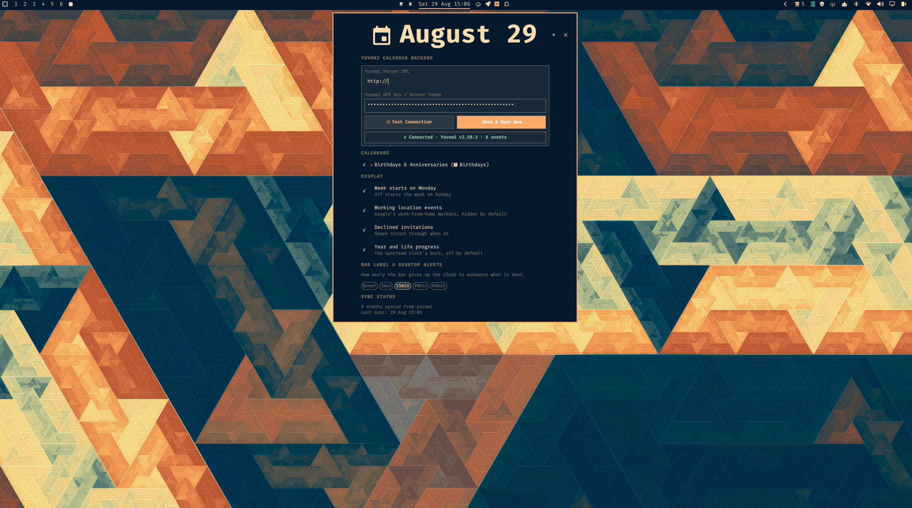
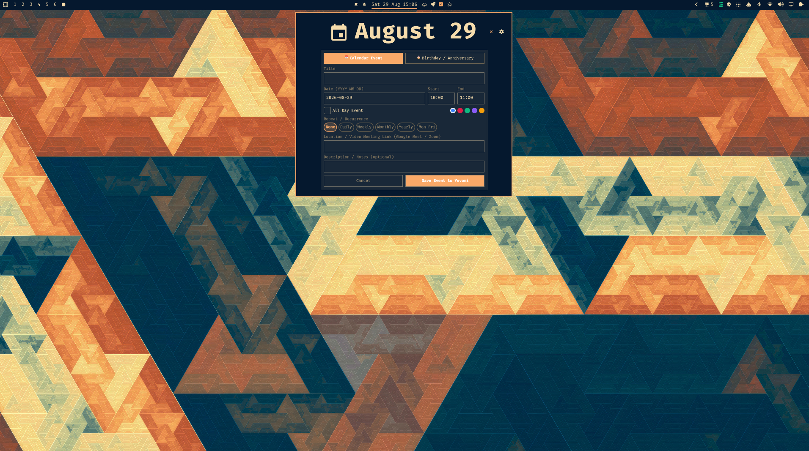
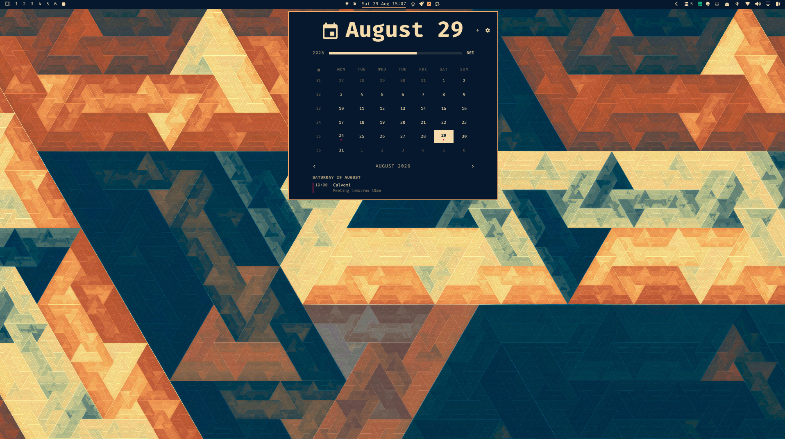

# OmaCalvomi: Calendar and Agenda for Omarchy Desktop

A month grid calendar and daily agenda flyout for Omarchy Desktop with deep Yuvomi synchronization, recurring events, birthday tracking, and desktop meeting alerts.



> [!IMPORTANT]
> **Yuvomi Required**: This plugin synchronizes with a self-hosted [Yuvomi](https://github.com/Yuvomi/yuvomi) instance (v2.50+). You will need your Yuvomi server URL and an API Bearer token.

---

## Features

- **Month Grid and ISO Weeks**:
  - Full month grid with ISO week numbers.
  - Multi-colored event dots per day.
  - Year and life progress gauges.
- **Quick Event and Birthday Creator (`+` / `n`)**:
  - Direct event creation with start and end time, all-day toggle, location or video links, and color picker.
  - Repeat and recurrence rules (Daily, Weekly, Monthly, Yearly, Mon-Fri).
  - Dedicated Birthday Creator with automated age calculation and reminder lead time.
- **Desktop Meeting Alerts**:
  - Dispatches desktop notifications (`notify-send`) 5 to 15 minutes before meetings start with video join links.
- **In-Panel Settings**:
  - Configure Server URL and API Key directly in the UI.
  - Live connection tester and instant sync.

---

## Previews




---

## Keyboard Shortcuts

| Key | Action |
|---|---|
| `n` / `+` | Open Quick Event / Birthday Creator |
| `t` | Jump to Today |
| `[` / `]` | Previous / Next Month |
| `{` / `}` | Previous / Next Year |
| `r` | Refresh and Re-sync |
| `Esc` | Close flyout |

---

## Configuration

Configure via the in-panel settings tab, or manually in `~/.config/omarchy/yuvomi-sync.json`:
```json
{
  "baseUrl": "http://yuvomi.local:3000",
  "apiKey": "YOUR_YUVOMI_API_KEY",
  "window": {
    "pastDays": 14,
    "futureDays": 90
  }
}
```

---

## License

Source-Available Non-Commercial License (PolyForm Noncommercial 1.0.0). Free for personal, educational, and homelab use. Commercial sale, distribution for fee, or commercial re-licensing is prohibited without author permission.
